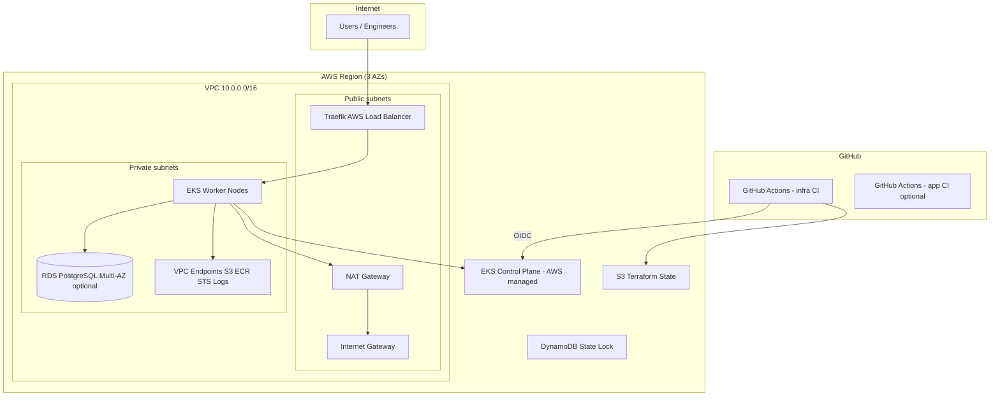
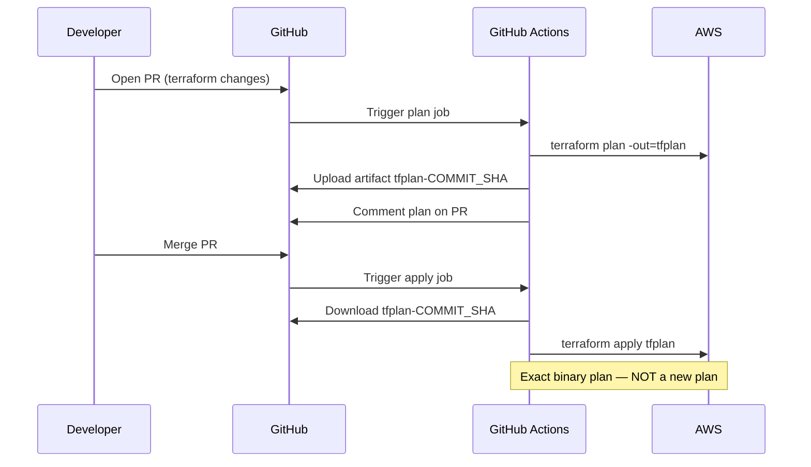

# Bank EKS — Total Blueprint (Infrastructure Repo)

**Repo:** `bank-eks-infra`  
**Purpose:** AWS infrastructure + Kubernetes platform layer — everything except application manifests.  
**Companion repo:** `bank-eks-app` (workloads synced by Argo CD)

Read this document top-to-bottom once, then use it as your interview whiteboard reference.

---

## 1. What we are building (one sentence)

A **production-pattern AWS EKS platform** on Terraform with **CI-driven deploys**, **remote state**, **GitHub OIDC**, **Calico network policies**, **Traefik ingress**, **Argo CD GitOps**, and **RDS PostgreSQL** — split from the app so infra and releases are independent.

---

## 2. Big picture — two repos

```
┌─────────────────────────────────────────────────────────────────────────┐
│                         YOUR LAPTOP (bootstrap only once)               │
│                    terraform/bootstrap → S3 state + OIDC role             │
└─────────────────────────────────────────────────────────────────────────┘
                                    │
        ┌───────────────────────────┴───────────────────────────┐
        ▼                                                       ▼
┌───────────────────┐                                 ┌───────────────────┐
│  bank-eks-infra   │                                 │  bank-eks-app     │
│  (THIS REPO)      │                                 │  (APP REPO)       │
│                   │                                 │                   │
│  Terraform CI     │                                 │  k8s manifests    │
│  VPC EKS RDS      │    Argo CD watches ────────────►│  frontend api     │
│  Calico Traefik   │         Git URL                 │  ingress policies │
│  Argo CD cert-mgr │                                 │                   │
└─────────┬─────────┘                                 └─────────┬─────────┘
          │                                                     │
          └─────────────────────┬───────────────────────────────┘
                                ▼
                    ┌───────────────────────┐
                    │   AWS Account         │
                    │   EKS + VPC + RDS     │
                    └───────────────────────┘
```

| Responsibility | Infra repo | App repo |
|----------------|------------|----------|
| VPC, subnets, NAT | ✅ | ❌ |
| EKS cluster, nodes | ✅ | ❌ |
| RDS PostgreSQL | ✅ | ❌ |
| Calico, Traefik, Argo CD | ✅ | ❌ |
| Frontend / API Deployments | ❌ | ✅ |
| NetworkPolicy, PDB | ❌ | ✅ (synced by Argo) |
| Ingress rules for app | ❌ | ✅ |

---

## 3. AWS architecture diagram



---

## 4. Kubernetes platform stack (what runs on the cluster)

| Layer | Component | Namespace | Installed by | What it does |
|-------|-----------|-----------|--------------|--------------|
| CNI | AWS VPC CNI | `kube-system` | EKS addon | Assigns **real VPC IPs** to pods |
| DNS | CoreDNS | `kube-system` | EKS addon | `service.namespace.svc.cluster.local` |
| Network | kube-proxy | `kube-system` | EKS addon | Service ClusterIP → pod IPs |
| **Policy** | **Calico** | `calico-system` | Terraform Helm | **Enforces NetworkPolicy** |
| **Ingress** | **Traefik** | `traefik` | Terraform Helm | **Ingress Controller** — L7 routing |
| **GitOps** | **Argo CD** | `argocd` | Terraform Helm | Syncs `bank-eks-app` Git → cluster |
| TLS | cert-manager | `cert-manager` | Terraform Helm | Certificates (self-signed or Let's Encrypt) |
| Optional | AWS LBC | `kube-system` | Terraform (off) | ALB Ingress instead of Traefik |

**Workloads** (from app repo): `three-tier` namespace — frontend, api, ingress, PDB, policies.

---

## 5. Request path (user hits your app)

```
1. User → http://<traefik-lb-hostname>/
2. AWS Load Balancer (Traefik Service type LoadBalancer)
3. Traefik pod reads Ingress (ingressClassName: traefik)
4. Path /     → Service frontend → frontend pod IP (10.0.x.x)
5. Path /api  → Service api      → api pod IP (10.0.x.x)
6. api pod → RDS endpoint (private, port 5432, via SG rules)
```

**Calico** sits between pods: NetworkPolicy allows only frontend→api and api→RDS path.

---

## 6. Repository file map (this repo)

```
bank-eks-infra/
├── BLUEPRINT.md                 ← YOU ARE HERE (master reference)
├── README.md                    ← Quick start
├── docs/
│   ├── CI.md                    ← GitHub Actions + plan artifacts
│   ├── TWO-REPOS.md             ← Why split repos
│   ├── NETWORKING.md            ← Deep dive: CNI, Services, kubectl apply
│   ├── PLATFORM.md              ← Calico, Traefik, Argo CD details
│   └── ARCHITECTURE.md          ← Component summary
├── .github/workflows/
│   └── terraform.yml            ← validate → plan → apply (stored tfplan)
└── terraform/
    ├── bootstrap/               ← ONE-TIME: S3, DynamoDB, GitHub OIDC IAM
    ├── backend.tf               ← S3 remote state config
    ├── vpc.tf                   ← VPC, NAT, VPC endpoints
    ├── eks.tf                   ← EKS cluster + node groups + addons
    ├── rds.tf                   ← PostgreSQL private
    ├── irsa.tf                  ← cert-manager, optional AWS LBC
    ├── platform.tf              ← Calico, Traefik, Argo CD Application
    ├── platform-variables.tf    ← enable_* toggles, app_repo_url
    ├── variables.tf             ← cluster, node, RDS vars
    ├── outputs.tf               ← cluster name, RDS endpoint, etc.
    └── terraform.tfvars.example ← Copy → terraform.tfvars or CI vars
```

---

## 7. Terraform apply order (what gets created)

| Step | Resource | Time | Notes |
|------|----------|------|-------|
| 1 | VPC, subnets, IGW, NAT | ~2 min | 3 AZs, public + private |
| 2 | VPC endpoints | ~1 min | S3, ECR, STS, Logs |
| 3 | EKS control plane | ~10 min | API endpoint, etcd encrypted |
| 4 | Managed node group | ~5 min | t3.medium, private subnets |
| 5 | EKS addons | ~2 min | vpc-cni, coredns, kube-proxy |
| 6 | RDS PostgreSQL | ~10 min | Private, SG from node SG |
| 7 | Calico (Tigera) | ~5 min | NetworkPolicy enforcement |
| 8 | Traefik | ~2 min | LoadBalancer Service |
| 9 | cert-manager | ~2 min | ClusterIssuer |
| 10 | Argo CD + Application | ~3 min | Points to bank-eks-app URL |

**Total:** ~15–25 minutes first apply.

---

## 8. CI/CD blueprint (no manual terraform from laptop)

### Authentication

- **No static AWS keys** in GitHub
- **GitHub OIDC** → IAM role `bank-eks-github-actions` (created in bootstrap)
- Bootstrap trusts **both** repos: `bank-eks-infra`, `bank-eks-app`

### Remote state

| Store | Purpose |
|-------|---------|
| S3 bucket | `terraform.tfstate` |
| DynamoDB | Lock ID — prevents two applies at once |
| Encryption | SSE on bucket |

### Plan artifact workflow (bank pattern)



| Event | Jobs |
|-------|------|
| PR to `main` | `validate` → `plan` (store artifact) |
| Merge to `main` | `apply` (download artifact → `terraform apply tfplan`) |
| Manual destroy | `destroy` (requires `production` environment) |

**Rule:** Direct push to `main` without PR → no stored plan → apply **fails**. Forces review workflow.

---

## 9. Bootstrap (one-time, from laptop)

```bash
cd terraform/bootstrap
cp terraform.tfvars.example terraform.tfvars
# Set: unique S3 bucket name, github_org, github_repos
terraform init && terraform apply
```

Creates:

1. S3 bucket (versioned, encrypted, private)
2. DynamoDB table `bank-eks-tf-locks`
3. GitHub OIDC provider
4. IAM role for both repos

Then set GitHub **Variables** and **Secret** `TF_VAR_db_password` (see `docs/CI.md`).

---

## 10. Configuration checklist

### GitHub Variables (infra repo)

| Variable | Example |
|----------|---------|
| `AWS_REGION` | `us-east-1` |
| `AWS_ROLE_ARN` | from bootstrap output |
| `TF_STATE_BUCKET` | from bootstrap |
| `TF_STATE_KEY` | `bank-eks/dev/terraform.tfstate` |
| `TF_STATE_LOCK_TABLE` | `bank-eks-tf-locks` |

### GitHub Secret (infra repo)

| Secret | Purpose |
|--------|---------|
| `TF_VAR_db_password` | RDS master password |

### terraform.tfvars (important values)

| Variable | Dev default | Prod interview answer |
|----------|-------------|-------------------------|
| `single_nat_gateway` | `true` | `false` (NAT per AZ) |
| `cluster_endpoint_public_access` | `true` | `false` + VPN |
| `enable_traefik` | `true` | `true` |
| `enable_calico` | `true` | `true` |
| `enable_argocd` | `true` | `true` |
| `app_repo_url` | your GitHub app repo URL | same |

---

## 11. After deploy — verification commands

```bash
aws eks update-kubeconfig --region us-east-1 --name bank-eks-dev

# Platform
kubectl get nodes
kubectl get pods -n calico-system
kubectl get pods -n traefik
kubectl get pods -n argocd
kubectl -n argocd get applications

# Traefik URL
kubectl -n traefik get svc traefik

# RDS (from terraform output)
cd terraform && terraform output -raw rds_endpoint

# Argo CD password
kubectl -n argocd get secret argocd-initial-admin-secret \
  -o jsonpath='{.data.password}' | base64 -d && echo
```

---

## 12. Security model (interview summary)

| Layer | Control |
|-------|---------|
| Network | Private subnets for nodes + RDS; public only for LB/NAT |
| SG | RDS accepts 5432 **only** from EKS node security group |
| Pod | Calico NetworkPolicy — default deny + explicit allow |
| Identity | IRSA for cert-manager; OIDC for CI |
| Secrets | RDS password in GitHub Secret; K8s secret **not** in Git |
| State | S3 encrypted + DynamoDB lock |
| Audit | EKS control plane logs enabled |
| etcd | Kubernetes Secrets encrypted |

---

## 13. Interview question → where to look

| Question | Answer location |
|----------|-----------------|
| What happens on `kubectl apply`? | `docs/NETWORKING.md` §2 |
| How do pods get IP addresses? | `docs/NETWORKING.md` §3 (VPC CNI) |
| Ingress vs Service? | `docs/NETWORKING.md` §4–6 |
| NetworkPolicy not working? | Calico — `docs/PLATFORM.md` |
| Private app, no internet exposure? | Internal LB + private API endpoint |
| Plan vs apply in CI? | `docs/CI.md` + §8 above |
| Why two repos? | `docs/TWO-REPOS.md` |
| PDB / HA? | App repo `k8s/policies/api-pdb.yaml` |

---

## 14. Cost estimate (dev settings, left running)

| Resource | ~Monthly |
|----------|----------|
| EKS control plane | $73 |
| 2× t3.medium nodes | ~$60 |
| NAT (single) | ~$35 + data |
| RDS db.t3.micro | ~$15 |
| Traefik LB | ~$20 |
| **Total** | **~$150–250** |

Run `terraform destroy` when not studying.

---

## 15. Learning path (use this repo)

| Week | Focus | Action |
|------|-------|--------|
| 1 | VPC + routing | Draw `vpc.tf` on paper; trace packet public→private |
| 2 | EKS + CNI | Read `NETWORKING.md`; run verification commands |
| 3 | Platform | Install mental model: Calico, Traefik, Argo CD |
| 4 | CI + interview | Explain §8 plan artifact flow without notes |

---

## 16. Related documents

| Doc | When to read |
|-----|--------------|
| [docs/CI.md](docs/CI.md) | Setting up GitHub Actions |
| [docs/NETWORKING.md](docs/NETWORKING.md) | Kubernetes networking deep dive |
| [docs/PLATFORM.md](docs/PLATFORM.md) | Calico / Traefik / Argo CD |
| [docs/TWO-REPOS.md](docs/TWO-REPOS.md) | Repo split rationale |
| [../bank-eks-app/BLUEPRINT.md](../bank-eks-app/BLUEPRINT.md) | App repo blueprint |

---

*Last aligned with: EKS managed node groups, Traefik ingress, Calico policy-only on EKS, Argo CD GitOps, Terraform plan artifacts.*
